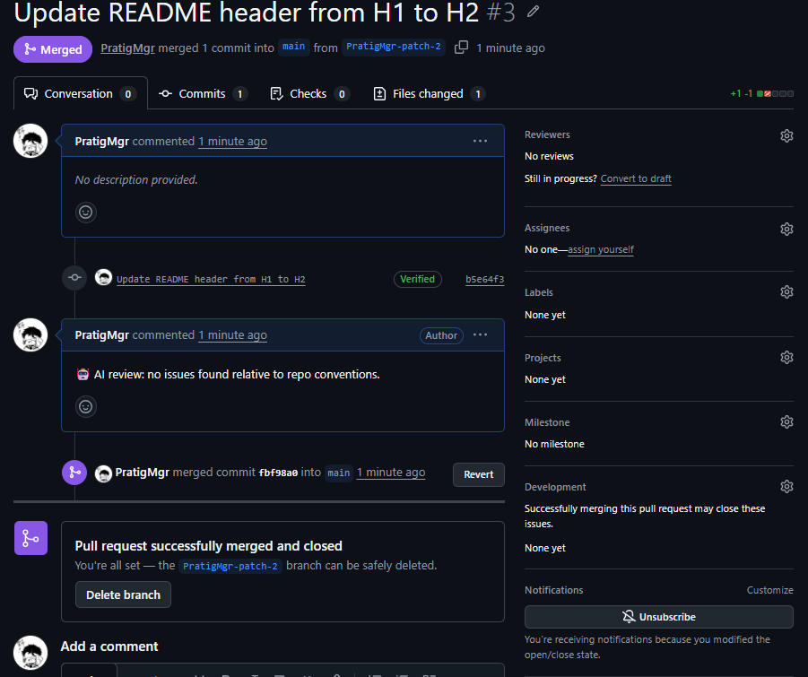
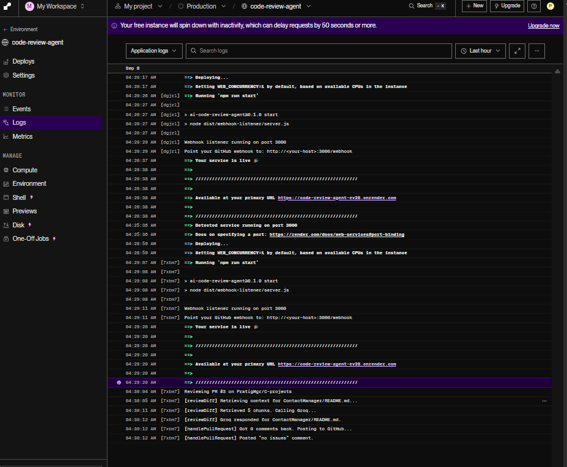

# AI Code Review Agent

An agent that reviews GitHub pull requests against a repo's **own existing conventions**
(learned via embeddings of the codebase itself) rather than generic linting rules —
with a built-in eval harness that objectively scores review quality.

## Demo — seeing it work end-to-end

A pull request gets opened, the agent reviews the diff against the repo's own conventions,
and posts its verdict as a comment automatically — no manual step required:



Behind the scenes, the deployed webhook listener picks up the PR event, retrieves relevant
context from the vector store, calls Groq, and posts the result — all visible in real time
in the service logs:



## Why this exists

Most "AI code review" demos are a thin wrapper around a single prompt: send the diff,
get generic feedback back. This project does three things differently:

1. **Retrieval-grounded reviews.** Before reviewing a diff, the agent retrieves
   similar existing code from the target repo (via a vector store) so its
   feedback is grounded in how *this* codebase actually does things —
   naming, error handling, structure — not generic "best practices."
2. **A measurable eval harness.** `eval-harness/` contains labeled test cases
   (diffs with known planted issues) and a grader that scores the agent's
   output against them. This turns "does the agent work?" from a vibe check
   into a number you can track over time, across prompt or model changes.
3. **Free to run, one deployable service.** The LLM runs on Groq's free tier
   (no card required) and embeddings run locally via transformers.js. The
   vector store is a JSON file computed once and committed to the repo —
   no separate database service, no Docker container to juggle. The only
   thing that needs deploying is the webhook listener itself.

## Architecture

```
webhook-listener/   Express server, receives GitHub PR webhooks, triggers reviews
agent-core/          Config, vector store, review generation (the "agent")
eval-harness/        Labeled test cases + grader + CLI runner
scripts/             One-off script to index a target repo's code into the vector store
data/                Committed JSON file of embeddings (built-in vector store)
```

## Setup

1. **Get a free Groq API key** — https://console.groq.com (no card required)

2. **Install dependencies**
   ```bash
   npm install
   ```
   First run will also download a small (~90MB) local embedding model
   automatically via `@xenova/transformers` — one-time, then fully offline.

3. **Copy the env file and fill in your details**
   ```bash
   cp .env.example .env
   ```
   You'll need:
   - `GITHUB_TOKEN` — a personal access token with `repo` scope, for local dev
   - `GITHUB_WEBHOOK_SECRET` — any string you make up, used to verify webhook payloads
   - `TARGET_REPO` — the `owner/repo` you want the agent to review
   - `GROQ_API_KEY` — from step 1 (defaults to the `llama-3.3-70b-versatile` model)

4. **Index the target repo** (computes embeddings for its existing code and
   writes them to `data/embeddings.json`)
   ```bash
   npm run index-repo
   ```
   Commit the resulting JSON file — that's the whole "vector store."

5. **Run the eval suite** to confirm the agent is working correctly
   ```bash
   npm run eval
   ```

6. **Start the webhook listener**
   ```bash
   npm run dev
   ```
   For local testing, expose it with a tunnel (e.g. `ngrok http 3000`) and point
   a GitHub webhook (Settings → Webhooks) at `https://<your-tunnel>/webhook`,
   subscribed to "Pull requests" events.

## Deployment

Only the webhook listener needs to run anywhere — there's no vector database
or local model server to host alongside it.

1. Push the repo (including `data/embeddings.json`) to GitHub.
2. Create a new **Web Service** on Render, pointed at the repo.
   - Build command: `npm install && npm run build`
   - Start command: `npm start`
3. Add the same environment variables from `.env` in Render's dashboard
   (`GITHUB_TOKEN`, `GITHUB_WEBHOOK_SECRET`, `TARGET_REPO`, `GROQ_API_KEY`).
   Render sets `PORT` automatically.
4. Point the GitHub webhook at your Render URL (`https://<your-app>.onrender.com/webhook`).

Render's free tier CPU is enough for this — the only local compute is the
small embedding model, and it's just running inference on short code chunks
at request time, not training or indexing at scale.

> **Note on Render's free tier:** the instance spins down after inactivity, which
> can delay the first webhook delivery by 30–60+ seconds while it wakes back up
> (visible above in the logs as a full `Deploying...` → `Your service is live` cycle).
> For a demo you plan to show live, either keep the service warm with a periodic
> ping to `/health`, or expect — and mention — that first-request delay.

## The eval harness (the differentiator)

`npm run eval` runs the agent against a set of diffs with known planted issues
(missing null checks, hardcoded secrets, unhandled promise rejections, and a
"clean code" case to catch over-eager false positives) and prints a pass/fail
scorecard.

This is the piece worth walking an interviewer through: it's the difference
between "I called an LLM API" and "I built a system with a way to measure
whether it's actually working." Grow `eval-harness/test-cases.ts` over time —
every review the agent gets wrong in real use should become a new regression
test.

## Known limitations (be upfront about these)

- Chunking in `scripts/index-repo.ts` is naive (fixed line count) — a stronger
  version would chunk by function/class boundary using an AST parser.
- The grader in `eval-harness/grader.ts` uses keyword matching, which is a
  reasonable starting point but a "judge model" (a second LLM call that scores
  the first one's output against a rubric) would be more robust — a good
  next iteration.
- The built-in JSON vector store is a brute-force cosine similarity search —
  fine at this repo's scale (~48 chunks, effectively instant), but it would
  need to become an ANN index or a real vector DB if a target repo grew into
  the tens of thousands of chunks.
- Currently reviews via a personal access token; a production version would
  register a proper GitHub App for cleaner permissions scoping.
- Groq's free tier has rate limits that a high-traffic repo could hit; a
  production version would add retry/backoff and a request queue.

## Stack

React (optional dashboard, not yet built) · TypeScript · Node.js · Express ·
Groq (cloud LLM, free tier) · transformers.js (local embeddings) ·
built-in JSON vector store · GitHub REST API & Webhooks · Render (deployment)